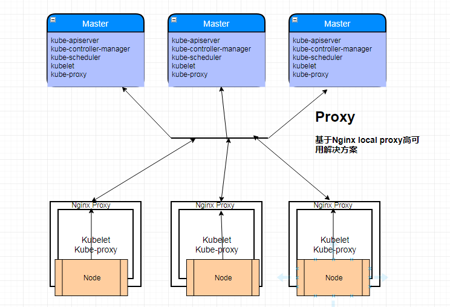

# SaltStack自动化部署HA-Kubernetes
- 本项目在GitHub上，会不定期更新，大家也可以提交ISSUE，地址为：`https://github.com/skymyyang/salt-k8s-ha`
- SaltStack自动化部署Kubernetes v1.15.4版本（支持HA、TLS双向认证、RBAC授权、Flannel网络、ETCD集群、Kuber-Proxy使用LVS等）。


## 版本明细：Release-v1.15.4
- 测试通过系统：CentOS 7.6
- Kernel Version: 4.18.16-1.el7.elrepo.x86_64
- salt-ssh:     salt-ssh 2019.2.0-1
- Kubernetes：  v1.15.4
- Etcd:         v3.3.13
- Docker-ce:    v18.09.2
- Flannel：     v0.11.0
- CNI-Plugins： v0.7.4
- nginx:        v1.16.1

建议部署节点：最少三个Master节点，请配置好主机名解析（必备）。以下是最小配置，否则可能不成功。

IP地址 | Hostname | 最小配置 | Kernel Version
---|--- | --- | --- |
192.168.200.181 | linux-node1 | Centos7.6 4G 2CPU | 4.18.16-1.el7.elrepo.x86_64
192.168.200.182 | linux-node2 | Centos7.6 4G 2CPU | 4.18.16-1.el7.elrepo.x86_64
192.168.200.183 | linux-node3 | Centos7.6 4G 2CPU | 4.18.16-1.el7.elrepo.x86_64
192.168.200.184 | linux-node4 | Centos7.6 4G 2CPU | 4.18.16-1.el7.elrepo.x86_64

## 架构介绍
1. 使用Salt Grains进行角色定义，增加灵活性。
2. 使用Salt Pillar进行配置项管理，保证安全性。
3. 使用Salt SSH执行状态，不需要安装Agent，保证通用性。
4. 使用Kubernetes当前稳定版本v1.15.4，保证稳定性。
5. 使用nginx来保证集群的高可用。
6. KeepAlive+VIP的形式完成高可用的缺点
    - 受限于使用者的网络，无法适用于SDN网络，比如Aliyun的VPC
    - 虽然是高可用的，但是流量还是单点的，所有node的的网络I/O都会高度集中于一台机器上（VIP)，一旦集群节点增多，pod增多，单机的网络I/O迟早是网络隐患。
7. 本文的高可用可通用于任何云上的SDN环境和自建机房环境，列如阿里云的VPC环境中
8. 本架构ETCD集群使用的是HTTP协议。

## 关于ETCD要不要使用TLS？

1. 首先TLS的目的是为了鉴权为了防止别人任意的连接上你的etcd集群。其实意思就是说如果你要放到公网上的ETCD集群，并开放端口，我建议你一定要用TLS。
2. 如果你的ETCD集群跑在一个内网环境比如（VPC环境），而且你也不会开放ETCD端口，你的ETCD跑在防火墙之后，一个安全的局域网中，那么你用不用TLS，都行。

## 技术交流QQ群（加群请备注来源于Github）：

- Docker&Kubernetes：796163694

- 本教程的来源于以下教程而生成，在此特别感谢两位作者。

  1. 和我一步步部署 kubernetes 集群   `https://github.com/opsnull/follow-me-install-kubernetes-cluster`

  2. SaltStack自动化部署Kubernetes    `https://github.com/unixhot/salt-kubernetes`

## 案例架构图

  

## 0.系统初始化(必备)

1. 设置主机名！！！

```bash
[root@linux-node1 ~]# cat /etc/hostname
linux-node1

[root@linux-node2 ~]# cat /etc/hostname
linux-node2

[root@linux-node3 ~]# cat /etc/hostname
linux-node3

[root@linux-node4 ~]# cat /etc/hostname
linux-node4
```

2. 设置/etc/hosts保证主机名能够解析

```bash
[root@linux-node1 ~]# cat /etc/hosts
127.0.0.1   localhost localhost.localdomain localhost4 localhost4.localdomain4
::1         localhost localhost.localdomain localhost6 localhost6.localdomain6
192.168.200.181 linux-node1
192.168.200.182 linux-node2
192.168.200.183 linux-node3
192.168.200.184 linux-node4
```

3. 关闭SELinux和防火墙以及NetworkManager

```bash
systemctl disable --now firewalld NetworkManager
setenforce 0
sed -ri '/^[^#]*SELINUX=/s#=.+$#=disabled#' /etc/selinux/config
```

4. 升级内核

<table border="0">
       <tr>
           <td><a href="docs/update-kernel.md">升级内核</a></td>
       </tr>
</table>

5. 以上必备条件必须严格检查，否则，一定不会部署成功！

## 1.设置部署节点到其它所有节点的SSH免密码登录（包括本机）
```bash
[root@linux-node1 ~]# ssh-keygen -t rsa
[root@linux-node1 ~]# ssh-copy-id linux-node1
[root@linux-node1 ~]# ssh-copy-id linux-node2
[root@linux-node1 ~]# ssh-copy-id linux-node3
[root@linux-node1 ~]# ssh-copy-id linux-node4
[root@linux-node1 ~]# scp /etc/hosts linux-node2:/etc/
[root@linux-node1 ~]# scp /etc/hosts linux-node3:/etc/
[root@linux-node1 ~]# scp /etc/hosts linux-node4:/etc/
```

## 2.安装Salt-SSH并克隆本项目代码。

2.1 安装Salt SSH（注意：老版本的Salt SSH不支持Roster定义Grains，需要2017.7.4以上版本）
```bash
[root@linux-node1 ~]# yum install -y https://mirrors.aliyun.com/saltstack/yum/redhat/salt-repo-latest-2.el7.noarch.rpm
[root@linux-node1 ~]# sed -i "s/repo.saltstack.com/mirrors.aliyun.com\/saltstack/g" /etc/yum.repos.d/salt-latest.repo
[root@linux-node1 ~]# yum install -y salt-ssh git unzip p7zip
```

2.2 获取本项目 `master` 分支代码，并放置在 `/srv` 目录

```bash
[root@linux-node1 ~]# git clone https://github.com/skymyyang/salt-k8s-ha.git
[root@linux-node1 ~]# cd salt-k8s-ha/
[root@linux-node1 ~]# mv * /srv/
[root@linux-node1 srv]# /bin/cp /srv/roster /etc/salt/roster
[root@linux-node1 srv]# /bin/cp /srv/master /etc/salt/master
```

2.4 下载二进制文件，也可以自行官方下载，为了方便国内用户访问，请在百度云盘下载,下载 `k8s-v1.15.4-auto.7z` 。
下载完成后，将文件移动到 `/srv/salt/k8s/` 目录下，并解压，注意是 `files` 目录在 `/srv/salt/k8s/`目录下。
Kubernetes二进制文件下载地址： 链接：`https://pan.baidu.com/s/1I_3PI8gsY1lvfd96zn7Zsg&shfl=sharepset`
提取码：`lfwq`


```bash
[root@linux-node1 ~]# cd /srv/salt/k8s/
[root@linux-node1 k8s]# 7za x k8s-v1.15.4-auto.7z -r -o./
[root@linux-node1 k8s]# rm -f k8s-v1.15.4-auto.7z
[root@linux-node1 k8s]# ls -l files/
total 0
drwx------ 2 root root  94 Mar 18 13:41 cfssl-1.2
drwx------ 2 root root 195 Mar 18 13:41 cni-plugins-amd64-v0.7.4
drwx------ 3 root root 123 Mar 18 13:41 etcd-v3.3.13-linux-amd64
drwx------ 2 root root  47 Mar 18 13:41 flannel-v0.11.0-linux-amd64
drwx------ 3 root root  17 Mar 18 13:41 k8s-v1.15.4
drwx------ 2 root root  33 Mar 18 20:17 nginx-1.16.1
```

## 3.Salt SSH管理的机器以及角色分配

- k8s-role: 用来设置K8S的角色
- etcd-role: 用来设置etcd的角色，如果只需要部署一个etcd，只需要在一台机器上设置即可
- etcd-name: 如果对一台机器设置了etcd-role就必须设置etcd-name

[root@linux-node1 ~]# vim /etc/salt/roster

```yaml

linux-node1:
  host: 192.168.200.181
  user: root
  priv: /root/.ssh/id_rsa
  minion_opts:
    grains:
      k8s-role: master
      etcd-role: node
      etcd-name: etcd-node1
      admin-role: master

linux-node2:
  host: 192.168.200.182
  user: root
  priv: /root/.ssh/id_rsa
  minion_opts:
    grains:
      k8s-role: master
      etcd-role: node
      etcd-name: etcd-node2

linux-node3:
  host: 192.168.200.183
  user: root
  priv: /root/.ssh/id_rsa
  minion_opts:
    grains:
      k8s-role: master
      etcd-role: node
      etcd-name: etcd-node3

linux-node4:
  host: 192.168.200.184
  user: root
  priv: /root/.ssh/id_rsa
  minion_opts:
    grains:
      k8s-role: node
```

## 4.修改对应的配置参数，本项目使用Salt Pillar保存配置
```bash
[root@k8s-m1 ~]# vim /srv/pillar/k8s.sls
#设置Master的IP地址(必须修改)
MASTER_IP_M1: "192.168.200.181"
MASTER_IP_M2: "192.168.200.182"
MASTER_IP_M3: "192.168.200.183"
#设置Master的HOSTNAME完整的FQDN名称(必须修改)
MASTER_H1: "linux-node1"
MASTER_H2: "linux-node2"
MASTER_H3: "linux-node3"

#KUBE-APISERVER的反向代理地址端口
KUBE_APISERVER: "https://127.0.0.1:8443"

#设置ETCD集群访问地址（必须修改）
ETCD_ENDPOINTS: "http://192.168.200.181:2379,http://192.168.200.182:2379,http://192.168.200.183:2379"

FLANNEL_ETCD_PREFIX: "/kubernetes/network"

#设置ETCD集群初始化列表（必须修改）
ETCD_CLUSTER: "etcd-node1=http://192.168.200.181:2380,etcd-node2=http://192.168.200.182:2380,etcd-node3=http://192.168.200.183:2380"

#通过Grains FQDN自动获取本机IP地址，请注意保证主机名解析到本机IP地址
NODE_IP: {{ grains['fqdn_ip4'][0] }}
HOST_NAME: {{ grains['fqdn'] }}

#设置BOOTSTARP的TOKEN，可以自己生成
BOOTSTRAP_TOKEN: "be8dad.da8a699a46edc482"
TOKEN_ID: "be8dad"
TOKEN_SECRET: "da8a699a46edc482"
ENCRYPTION_KEY: "8eVtmpUpYjMvH8wKZtKCwQPqYRqM14yvtXPLJdhu0gA="

#配置Service IP地址段
SERVICE_CIDR: "10.96.0.0/16"

#Kubernetes服务 IP (从 SERVICE_CIDR 中预分配)
CLUSTER_KUBERNETES_SVC_IP: "10.96.0.1"

#Kubernetes DNS 服务 IP (从 SERVICE_CIDR 中预分配)
CLUSTER_DNS_SVC_IP: "10.96.0.2"

#设置Node Port的端口范围,已修改为默认配置,可自己自定义
NODE_PORT_RANGE: "30000-32767"

#设置POD的IP地址段
POD_CIDR: "10.244.0.0/16"
CLUSTER_CIDR: "10.244.0.0/16"

#设置集群的DNS域名
CLUSTER_DNS_DOMAIN: "cluster.local."

#设置网卡名称
VIP_IF: "eth0"

```

## 5.执行SaltStack状态

5.1 测试Salt SSH联通性

```bash
[root@k8s-m1 ~]# salt-ssh '*' test.ping
```
执行高级状态，会根据定义的角色再对应的机器部署对应的服务

5.2 部署Etcd，由于Etcd是基础组建，需要先部署，目标为部署etcd的节点。

增加etcd参数的优化。

- `--auto-compaction-retention`
由于ETCD数据存储多版本数据，随着写入的主键增加历史版本需要定时清理，默认的历史数据是不会清理的，数据达到2G就不能写入，必须要清理压缩历史数据才能继续写入;所以根据业务需求，在上生产环境之前就提前确定，历史数据多长时间压缩一次;推荐一小时压缩一次数据这样可以极大的保证集群稳定，减少内存和磁盘占用

- `--max-request-bytes` etcd Raft消息最大字节数，ETCD默认该值为1.5M; 但是很多业务场景发现同步数据的时候1.5M完全没法满足要求，所以提前确定初始值很重要;由于1.5M导致我们线上的业务无法写入元数据的问题，我们紧急升级之后把该值修改为默认32M，但是官方推荐的是10M，大家可以根据业务情况自己调整

- `--quota-backend-bytes` ETCD db数据大小，默认是2G，当数据达到2G的时候就不允许写入，必须对历史数据进行压缩才能继续写入;参加1里面说的，我们启动的时候就应该提前确定大小，官方推荐是8G，这里我们也使用8G的配置

```bash
[root@linux-node1 ~]# salt-ssh -L 'linux-node1,linux-node2,linux-node3' state.sls k8s.etcd
```
注：如果执行失败，新手建议推到重来，请检查各个节点的主机名解析是否正确（监听的IP地址依赖主机名解析）。

5.3 部署K8S集群-Master节点

这里首先安装master，由于worker节点的flannel的kubeconfig配置文件依赖API-server，所以必须先要部署master节点。

```bash
[root@linux-node1 ~]# salt-ssh -L 'linux-node1,linux-node2,linux-node3' state.sls k8s.master
```
由于包比较大，这里执行时间较长，5分钟+，喝杯咖啡休息一下，如果执行有失败可以再次执行即可！执行过程中存在cfssl生成证书的warning，大家可以忽略。

5.4 配置集群所需的RBAC的角色验证

```bash
[root@linux-node1 ~]# salt-ssh -L 'linux-node1' state.sls k8s.admin
```
5.5 部署K8S集群worker节点

```bash
[root@linux-node1 ~]# salt-ssh 'linux-node4' state.highstate
```

5.6 设置每个节点的roles

```bash
#在master节点上执行,并为master节点加上污点Taint
/opt/kubernetes/bin/kubectl label node linux-node1 node-role.kubernetes.io/master=""
/opt/kubernetes/bin/kubectl label node linux-node2 node-role.kubernetes.io/master=""
/opt/kubernetes/bin/kubectl label node linux-node3 node-role.kubernetes.io/master=""
/opt/kubernetes/bin/kubectl taint nodes linux-node1 node-role.kubernetes.io/master="":NoSchedule
/opt/kubernetes/bin/kubectl taint nodes linux-node2 node-role.kubernetes.io/master="":NoSchedule
/opt/kubernetes/bin/kubectl taint nodes linux-node3 node-role.kubernetes.io/master="":NoSchedule
#在node节点上执行
kubectl label node linux-node4 node-role.kubernetes.io/worker=worker
```
## 6.测试Kubernetes安装

```bash
#先验证etcd
[root@linux-node1 ~]# source /etc/profile
[root@linux-node1 ~]# etcdctl --endpoints=http://192.168.200.181:2379 cluster-health
member 1b59c715892a07 is healthy: got healthy result from http://192.168.200.183:2379
member 5a23180c9f872e86 is healthy: got healthy result from http://192.168.200.182:2379
member edf2d8c54db4c5e1 is healthy: got healthy result from http://192.168.200.181:2379
cluster is healthy
[root@linux-node1 ~]# etcdctl --endpoints=http://192.168.200.181:2379 member list
1b59c715892a07: name=etcd-node3 peerURLs=http://192.168.200.183:2380 clientURLs=http://192.168.200.183:2379 isLeader=true
5a23180c9f872e86: name=etcd-node2 peerURLs=http://192.168.200.182:2380 clientURLs=http://192.168.200.182:2379 isLeader=false
edf2d8c54db4c5e1: name=etcd-node1 peerURLs=http://192.168.200.181:2380 clientURLs=http://192.168.200.181:2379 isLeader=false
[root@linux-node1 ~]# kubectl get cs
NAME                 STATUS    MESSAGE             ERROR
controller-manager   Healthy   ok
scheduler            Healthy   ok
etcd-2               Healthy   {"health":"true"}
etcd-1               Healthy   {"health":"true"}
etcd-0               Healthy   {"health":"true"}
[root@linux-node1 ~]# kubectl get node
NAME          STATUS   ROLES    AGE     VERSION
linux-node1   Ready    master   17m     v1.15.4
linux-node2   Ready    master   16m     v1.15.4
linux-node3   Ready    master   16m     v1.15.4
linux-node4   Ready    worker   9m39s   v1.15.4
```
## 7.测试Kubernetes集群和Flannel网络

```bash
[root@linux-node1 ~]# kubectl create deployment nginx --image=nginx:alpine
deployment.apps/nginx created
需要等待拉取镜像，可能稍有的慢，请等待。
[root@linux-node1 ~]# kubectl get pod -o wide
NAME                     READY   STATUS    RESTARTS   AGE   IP         NODE          NOMINATED NODE   READINESS GATES
nginx-54458cd494-zp9zp   1/1     Running   0          69s   10.244.2.2   linux-node3   <none>           <none>


测试联通性
[root@linux-node1 ~]# ping -c 1 10.244.2.2
PING 10.2.1.2 (10.2.1.2) 56(84) bytes of data.
64 bytes from 10.2.1.2: icmp_seq=1 ttl=61 time=0.729 ms

--- 10.2.1.2 ping statistics ---
1 packets transmitted, 1 received, 0% packet loss, time 0ms
rtt min/avg/max/mdev = 0.729/0.729/0.729/0.000 ms

[root@linux-node1 ~]# curl --head http://10.244.2.2
HTTP/1.1 200 OK
Server: nginx/1.15.9
Date: Tue, 19 Mar 2019 05:36:47 GMT
Content-Type: text/html
Content-Length: 612
Last-Modified: Fri, 08 Mar 2019 03:05:13 GMT
Connection: keep-alive
ETag: "5c81dbe9-264"
Accept-Ranges: bytes

测试扩容，将Nginx应用的Pod副本数量拓展到2个节点
[root@linux-node1 ~]# kubectl scale deployment nginx --replicas=2
deployment.extensions/nginx scaled
[root@linux-node1 ~]# kubectl get pod
NAME                     READY   STATUS    RESTARTS   AGE
nginx-54458cd494-nf946   1/1     Running   0          13s
nginx-54458cd494-zp9zp   1/1     Running   0          3m57s
```

## 8.如何新增Kubernetes节点

- 1.设置SSH无密码登录，并且在 `/etc/hosts` 中继续增加对应的解析。确保所有节点都能解析。
- 2.在 `/etc/salt/roster` 里面，增加对应的机器。
- 3.执行SaltStack状态 `salt-ssh 'linux-node5' state.highstate`

```Bash
[root@linux-node5 ~]# vim /etc/salt/roster
linux-node5:
  host: 192.168.200.185
  user: root
  priv: /root/.ssh/id_rsa
  minion_opts:
    grains:
      k8s-role: node
[root@linux-node1 ~]# salt-ssh 'linux-node5' state.highstate
```

## 9.下一步要做什么？

你可以安装Kubernetes必备的插件
<table border="0">
    <tr>
        <td><strong>必备插件</strong></td>
        <td><a href="docs/coredns.md">1.CoreDNS部署</a></td>
        <td><a href="docs/dashboard.md">2.Dashboard部署</a></td>
        <td><a href="docs/heapster.md">3.heapster部署</a></td>
        <td><a href="docs/metrics-server.md">4.Metrics Server</a></td>
        </tr>
      <tr>
        <td><strong>必备插件</strong></td>
        <td><a href="docs/ingress-nginx.md">5.Ingress-nginx部署</a></td>
        <td><a href="docs/ingress.md">6.Ingress扩展</a></td>
        <td><a href="docs/metallb.md">7.MetalLB</a></td>
        <td><a href="docs/helm.md">8.Helm部署</a></td>
    </tr>
</table>

## 10.（可选）可以把kube-proxy按照daemonset的方式部署;按照这种方式部署的话要先停用二进制安装的kube-proxy。

PS:这里配置不一样的话需要修改yaml文件。

```bash
[root@linux-node1 ~]# systemctl disable kube-proxy
[root@linux-node1 ~]# systemctl stop kube-proxy
[root@linux-node1 ~]# kubectl apply -f /srv/addons/kube-proxy/kube-proxy.yml
[root@linux-node1 ~]# kubectl get pod -n kube-system
NAME                      READY   STATUS    RESTARTS   AGE
coredns-cd7f66fdc-fxvx6   1/1     Running   2          18h
coredns-cd7f66fdc-ldjnh   1/1     Running   2          18h
kube-proxy-czxj9          1/1     Running   2          16h
kube-proxy-pjpt5          1/1     Running   2          16h
kube-proxy-wpfrh          1/1     Running   2          16h
kube-proxy-zgg6t          1/1     Running   2          16h
```
## 11. 一步一步安装kubernetes

手动安装
<table border="0">
    <tr>
        <td><strong>手动部署</strong></td>
        <td><a href="docs/init.md">1.系统初始化</a></td>
        <td><a href="docs/nginx-install.md">2.Nginx部署</a></td>
        <td><a href="docs/ca-install.md">3.CA部署</a></td>
        <td><a href="docs/etcd-install.md">4.ETCD集群部署</a></td>
        <td><a href="docs/master-install.md">5.Master节点部署</a></td>
        <td><a href="docs/node-install">6.Node节点部署</a></td>
        <td><a href="docs/flannel-install.md">7.Flannel部署</a></td>
    </tr>
</table>

插件安装请参考文档必备插件的部分。

## 12. 缩短Pod重启时间

在实际应用中，想要缩短Pod重启时间，可以修改kube-controller-manager配置中的以下几个参数：
```
--node-monitor-grace-period=10s \
--node-monitor-period=3s \
--node-startup-grace-period=20s \
--pod-eviction-timeout=10s \
```
kubernetes节点失效后pod的调度过程：
1. Master每隔一段时间和node联系一次，判定node是否失联，这个时间周期配置项为 node-monitor-period ，默认5s
2. 当node失联后一段时间后，kubernetes判定node为notready状态，这段时长的配置项为 node-monitor-grace-period ，默认40s
3. 当node失联后一段时间后，kubernetes判定node为unhealthy，这段时长的配置项为 node-startup-grace-period ，默认1m0s
4. 当node失联后一段时间后，kubernetes开始删除原node上的pod，这段时长配置项为 pod-eviction-timeout ，默认5m0s


## 捐赠

如果觉得本项目对您有帮助，请小小鼓励下项目作者，谢谢！
支付宝码(左)和微信钱包码(右)


