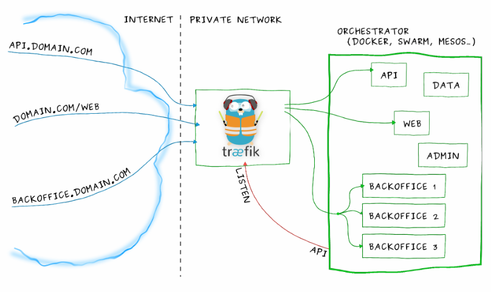
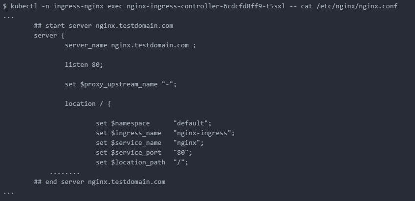

## Ingress Controller介绍与部署

Ingress Controller是一个统称,并不只有一个,如下:

- Ingress NGINX: Kubernetes 官方维护的方案,也是本次安装使用的 Controller。
- F5 BIG-IP Controller: F5 所开发的 Controller,它能够让管理员通过 CLI 或 API 让 Kubernetes 与 OpenShift 管理 F5 BIG-IP 设备。
- Ingress Kong: 著名的开源 API Gateway 方案所维护的 Kubernetes Ingress Controller。
- Traefik: 是一套开源的 HTTP 反向代理与负载均衡器,而它也支援了 Ingress。
- Voyager: 一套以 HAProxy 为底的 Ingress Controller。
- Envoy: 随着Service Mesh在最近一年的流行，Envoy 作为其中很关键的组件，也开始被广大技术人员熟悉.


 我们部署在集群里的服务的svc想暴露出来的时候,从长久眼光看和易于管理维护都是用的Ingress Controller来处理,clusterip非集群主机无法访问,Nodeport不方便长久管理和效率,LB服务多了不方便因为需要花费额外的钱,externalIPS不好用(后面有空写文章会说它)
我们跑的大多服务都是应用层http(s),Ingress Controller使用svc或者pod的网络将它暴露在集群外,然后它反向代理集群内的七层服务,通过vhost子域名那样路由到后端的服务,Ingress Controller工作架构如下,借用traefik官方的图:




你可以将api.domain.com进来的流量路由到集群里api的pod,你可以将backoffice.domain.com流量路由到backoffice的一组pod上

虽说我们可以自己搭建一个nginx来代替掉Ingress Controller,但是要增加代理的svc长期来看维护很不方便,在使用上Ingress Controller后可以用一种抽象的对象告诉controller添加对应的代理,也就是kind: Ingress. 它里面描述了从Ingress Controller访问进来的ServerName和web的url要代理到集群里哪个svc(以及svc的port)等等具体信息

而官方的Ingress Nginx可以视为一个魔改的nginx,拥有集群赋予的RBAC权限后,能够有监听集群Ingress相关的变化能力,用户创建了kind: Ingress,

例如上面trafik图里的Ingress大致就是下面这样

```yaml
apiVersion: extensions/v1beta1
kind: Ingress
metadata:
  name: my-ingress
  annotations:
    nginx.ingress.kubernetes.io/use-regex: "true"
spec:
  rules:
  - host: api.mydomain.com
    http:
      paths:
      - backend:
          serviceName: api
          servicePort: 80
  - host: domain.com
    http:
      paths:
      - path: /web/*
        backend:
          serviceName: web
          servicePort: 8080
  - host: backoffice.domain.com
    http:
      paths:
      - backend:
          serviceName: backoffice
          servicePort: 8080

```


只要创建了上面的Ingress后,ingress controller里会监听到从而生成对应的配置段后动态reload配置文件

## 部署

部署非常简单,一条命令创建即可,yml来源于 `https://github.com/kubernetes/ingress-nginx/tree/master/deploy/static`

```bash
kubectl apply -f https://raw.githubusercontent.com/kubernetes/ingress-nginx/master/deploy/static/mandatory.yaml
```
 该yaml缺少向群外暴露的方式,我们先使用externalIPs方式创建svc来让它能从集群外面访问(此处先学工作原理,后面再讲高可用)


$INGRESS_VIP选取一个和宿主机同一个段没使用过的IP即可(实际上Ingress Nginx bind的端口不止80和443,这里不讨论,有兴趣的同学可以看容器里的默认配置文件)

```yaml
apiVersion: v1
kind: Service
metadata:
  name: ingress-nginx
  namespace: ingress-nginx
  labels:
    app: ingress-nginx
spec:
  type: LoadBalancer
  externalIPs:
  - $INGRESS_VIP
  ports:
  - port: 80
    targetPort: 80
  selector:
    app: ingress-nginx
```

上面的yaml里后面详细解释我们需要关注的配置项,先来创建ingress对象试试

### 测试http 7层负载

部署了官方的ingress nginx后,我部署了一个nginx的pod,为它创建了一个名为nginx的svc

```yaml
apiVersion: extensions/v1beta1
kind: Deployment
metadata:
  name: nginx
spec:
  template:
    metadata:
      labels:
        app: nginx
    spec:
      containers:
      - image: nginx
        name: nginx
        ports:
        - containerPort: 80
---
apiVersion: v1
kind: Service
metadata:
  name: nginx
spec:
  selector:
    app: nginx
  ports:
    - protocol: TCP
      port: 80
      targetPort: 80
```

然后创建对应的一个ingress对象来暴露集群里这个nginx的http服务

```yaml
apiVersion: extensions/v1beta1
kind: Ingress
metadata:
  name: nginx-ingress
spec:
  rules:
  - host: nginx.testdomain.com
    http:
      paths:
      - backend:
          serviceName: nginx
          servicePort: 80
```

找到ingress nginx的pod名字后通过命令查看里面nginx配置文件能找到有对应的配置段生成




找一台非集群的Windows机器(也可以mac,主要是有图形界面且非集群内机器),设置hosts文件把域名nginx.testdomain.com设置到对svc的那个externalIPs的ip上,打开浏览器访问nginx.testdomain.com即可发现集群内的nginx已经暴露在集群外

- 注意: Ingress Controller虽然调用的是svc,看起来按照nginx来理解转发是client–nginx–svc–pod; 实际上转发是client–nginx–pod,因为已经魔改了不能按照nginx的来理解,是直接负载到svc的endpoint上面的

- 另外低版本的ingress nginx的args参数--default-backend-service=$(POD_NAMESPACE)/default-http-backend,该参数指定ingress nginx的同namespace下名为default-http-backend的svc作为默认访问的时候页面,通常那个时候是创建一个404页面的的pod和对应svc,如果ingress nginx启动的时候没找到这个svc会无法启动,新版本不是必须了,好像也自带404页面了

另外ingress也能多路径,如下:

```yaml
spec:
  rules:
  - host: xxxx.xxxx.xxx
    http:
      paths:
      - backend:
          serviceName: service-index
          servicePort: 80
        path: /
      - backend:
          serviceName: service-test-api
          servicePort: 80
        path: /api/
```

### 如何来4层负载
我们可以看到ingress nginx的args里有这两行

```
- --tcp-services-configmap=$(POD_NAMESPACE)/tcp-services
- --udp-services-configmap=$(POD_NAMESPACE)/udp-services
```

从选项和值可以猜测出,要想代理四层(tcp/udp),得写同namespace里一个名为tcp-service和udp-service的两个configmap的数据
四层的话这边我们创建一个mysql的pod,来代理3306端口到集群外面,则需要写tcp-services这个configmap

```yaml
kind: ConfigMap
apiVersion: v1
metadata:
  name: tcp-services
  namespace: ingress-nginx
data:
  3306: "default/mysql:3306"
```

四层写这两个cm的data即可,按照这样去写即可out_port: namespaces/svc_name:port,要给每个ingress加一些nginx里的配置可以查看官方的annotation字段以及值(traefik同理)

## Ingress Controller高可用

这里来讨论下Ingress Controller的高可用

Ingress Controller到集群内的路径这部分都有负载均衡了,我们比较关注部署了Ingress Controller后,外部到它这段路怎么高可用?

上面的例子里svc我使用的externalIPs,但是代理四层的时候会新加端口,需要每次人为去介入增加暴露端口?

流量从入口到Ingress Controller的pod有下面几种方式

- type为LoadBalancer的时候手写externalIPs很鸡肋,后面会再写文章去讲它
- type为LoadBalancer的时候只有云厂商支持分配公网ip来负载均衡,LoadBalancer 公开的每项服务都将获得自己的 IP 地址,但是需要收费,且自己建立集群无法使用
- 不创建svc,pod直接用hostport,效率等同于hostNetwork,如果不代理四层端口还好,代理了需要修改pod的template来滚动更新来让nginx bind的四层端口能映射到宿主机上
- Nodeport,端口不是web端口(但是可以修改Nodeport的范围改成web端口),如果进来流量负载到Nodeport上可能某个流量路线到某个node上的时候因为Ingress Controller的pod不在这个node上,会走这个node的kube-proxy转发到Ingress Controller的pod上,多走一趟路
- 不创建svc,效率最高,也能四层负载的时候不修改pod的template,唯一要注意的是hostNetworkk下pod会继承宿主机的网络协议,也就是使用了主机的dns,会导致svc的请求直接走宿主机的上到公网的dns服务器而非集群里的dns server,需要设置pod的dnsPolicy: ClusterFirstWithHostNet即可解决

部署方式没多大区别开心就好

- daemonSet + nodeSeletor
- deploy设置replicas数量 + nodeSeletor + pod互斥
- 所以可以一个vip飘在拥有存活的controller的宿主机上,云上的话就用slb来负载代替vip,自己有条件有F5之类的硬件LB一样可以代替VIP
- 最后说说域名请求指向它,如果部署在内网或者办公室啥的,内网有dns server的话把ing的域名全部解析到ingress controller的宿主机ip(或者VIP,LB的ip)上,否则要有人访问每个人设置/etc/hosts才能把域名解析来贼麻烦,如果没有dns server可以跑一个external-dns,它的上游dns是公网的dns服务器,办公网内机器的dns server指向它即可,云上的话把域名请求解析到对应ip即可
- traefik和ingress nginx类似,不过它用go实现的并且好像它不支持四层代理,如果上微服务可以上istio,没接触过它,不知道原理是否如此
- ingress nginx的log里会一直刷找不到ingress-nginx的svc不处理的话会狂刷log导致机器load过高,创建一个同名的svc即可解决,例如创建一个不带选择器clusterip为null的
- get ing输出的时候ADDRESS一栏会为空，ingress-nginx加参数--report-node-internal-ip-address即可解决
