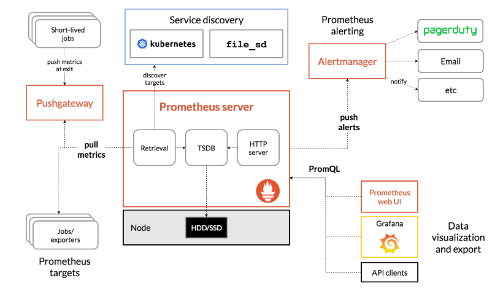
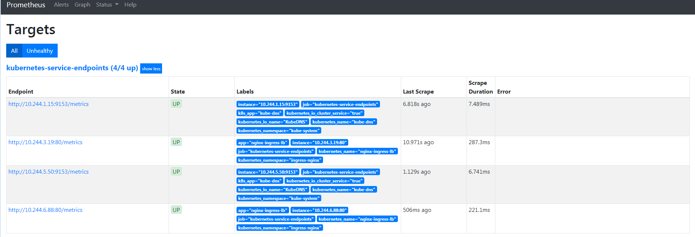

## 手动部署prometheus-operator监控

## 监控

由于之前只接触过zabbix，zaiibx的agent是通过查询/proc和/sys里的信息推送给zabbix-server。prometheus的`node-exporter`有选项`--path.procfs`和`--path.sysfs`来指定从这俩选项的值的proc和sys读取,容器跑node-exporter只需要挂载宿主机的/proc和/sys到容器fs的某个路径挂载属性设置为readonly后用这两个选项指定即可,zabbix4.0看了文档和容器都找不到类似选项应该不支持。

## 什么是metrics

prometheus的定义的metrics格式规范,缺省是在http(s)的url的/metrics输出

而metrics要么程序定义输出(模块或者自定义开发),要么用官方的各种exporter(node-exporter,mysqld-exporter,memcached_exporter…)采集要监控的信息占用一个web端口然后输出成metrics格式的信息,prometheus server去收集各个target的metrics存储起来(tsdb)

kubectl-apiserver也有metrics信息

```bash
$kubectl get --raw /metrics
...
rest_client_request_latency_seconds_bucket{url="https://[::1]:6443/apis?timeout=32s",verb="GET",le="0.512"} 39423
rest_client_request_latency_seconds_bucket{url="https://[::1]:6443/apis?timeout=32s",verb="GET",le="+Inf"} 39423
rest_client_request_latency_seconds_sum{url="https://[::1]:6443/apis?timeout=32s",verb="GET"} 24.781942557999795
rest_client_request_latency_seconds_count{url="https://[::1]:6443/apis?timeout=32s",verb="GET"} 39423
# HELP rest_client_requests_total Number of HTTP requests, partitioned by status code, method, and host.
# TYPE rest_client_requests_total counter
rest_client_requests_total{code="200",host="[::1]:6443",method="GET"} 2.032031e+06
rest_client_requests_total{code="200",host="[::1]:6443",method="PUT"} 1.106921e+06
rest_client_requests_total{code="201",host="[::1]:6443",method="POST"} 38
rest_client_requests_total{code="401",host="[::1]:6443",method="GET"} 17378
rest_client_requests_total{code="404",host="[::1]:6443",method="GET"} 3.546509e+06
rest_client_requests_total{code="409",host="[::1]:6443",method="POST"} 29
rest_client_requests_total{code="409",host="[::1]:6443",method="PUT"} 20
rest_client_requests_total{code="422",host="[::1]:6443",method="POST"} 1
rest_client_requests_total{code="503",host="[::1]:6443",method="GET"} 5
# HELP ssh_tunnel_open_count Counter of ssh tunnel total open attempts
# TYPE ssh_tunnel_open_count counter
ssh_tunnel_open_count 0
# HELP ssh_tunnel_open_fail_count Counter of ssh tunnel failed open attempts
# TYPE ssh_tunnel_open_fail_count counter
ssh_tunnel_open_fail_count 0
```
用户可以在prometheus的http页面上用promQL(prometheus的查询语言)或者(grafana数据来源就是用)api去查询一些信息,也可以利用pushgateway去统一采集然后prometheus从pushgateway采集(所以pushgateway类似于zabbix的proxy),prometheus的工作架构如下图:



## 为什么需要prometheus-operator

因为是prometheus主动去拉取的,所以在k8s里pod因为调度的原因导致pod的ip会发生变化,人工不可能去维持,自动发现有基于DNS的,但是新增还是有点麻烦

 Prometheus-operator的本职就是一组用户自定义的CRD资源以及Controller的实现，Prometheus Operator这个controller有RBAC权限下去负责监听这些自定义资源的变化，并且根据这些资源的定义自动化的完成如Prometheus Server自身以及配置的自动化管理工作.

 在Kubernetes中我们使用Deployment、DamenSet，StatefulSet来管理应用Workload，使用Service，Ingress来管理应用的访问方式，使用ConfigMap和Secret来管理应用配置。我们在集群中对这些资源的创建，更新，删除的动作都会被转换为事件(Event)，Kubernetes的Controller Manager负责监听这些事件并触发相应的任务来满足用户的期望。这种方式我们成为声明式，用户只需要关心应用程序的最终状态，其它的都通过Kubernetes来帮助我们完成，通过这种方式可以大大简化应用的配置管理复杂度。

 而除了这些原生的Resource资源以外，Kubernetes还允许用户添加自己的自定义资源(Custom Resource)。并且通过实现自定义Controller来实现对Kubernetes的扩展,不需要用户去二开k8s也能达到给k8s添加功能和对象

 因为svc的负载均衡,所以在K8S里监控metrics基本最小单位都是一个svc背后的pod为target,所以prometheus-operator创建了对应的CRD: kind: ServiceMonitor ,创建的ServiceMonitor里声明需要监控选中的svc的label以及metrics的url路径的和namespaces即可.

工作架构如下图所示:

 

 ## demo部署学习

 先获取相关文件后面跟着文件来讲,直接用git客户端拉取即可,不过文件大概30多M,没梯子基本拉不下来

 ```bash
 git clone https://github.com/coreos/prometheus-operator.git
 ```
 Prometheus Operator引入的自定义资源包括

 - Prometheus
 - ServiceMonitor
 - Alertmanager

 用户创建了prometheus-operator(也就是上面监听三个CRD的各种事件的controller)后,用户可以利用kind: Prometheus这种声明式创建对应的资源

 下面我们部署简单的例子学习prometheus-operator

 1. 创建prometheus-operator的pod

 拉取到文件后我们先创建prometheus-operator

 ```bash
$ cd prometheus-operator
$ kubectl apply -f bundle.yaml
clusterrolebinding.rbac.authorization.k8s.io/prometheus-operator created
clusterrole.rbac.authorization.k8s.io/prometheus-operator created
deployment.apps/prometheus-operator created
serviceaccount/prometheus-operator created
 ```

 确认pod运行,以及我们可以发现operator的pod在有RBAC下创建了一个APIService

```
 $ kubectl get pod
NAME                                   READY     STATUS    RESTARTS   AGE
prometheus-operator-6db8dbb7dd-djj6s   1/1       Running   0          1m
$ kubectl get APIService | grep monitor
v1.monitoring.coreos.com               2018-10-09T10:49:47Z
```
查看这个APISerivce

```
$ kubectl get --raw /apis/monitoring.coreos.com/v1
{
  "kind": "APIResourceList",
  "apiVersion": "v1",
  "groupVersion": "monitoring.coreos.com/v1",
  "resources": [
    {
      "name": "alertmanagers",
      "singularName": "alertmanager",
      "namespaced": true,
      "kind": "Alertmanager",
      "verbs": [
        "delete",
        "deletecollection",
        "get",
        "list",
        "patch",
        "create",
        "update",
        "watch"
      ]
    },
    {
      "name": "prometheuses",
      "singularName": "prometheus",
      "namespaced": true,
      "kind": "Prometheus",
      "verbs": [
        "delete",
        "deletecollection",
        "get",
        "list",
        "patch",
        "create",
        "update",
        "watch"
      ]
    },
    {
      "name": "servicemonitors",
      "singularName": "servicemonitor",
      "namespaced": true,
      "kind": "ServiceMonitor",
      "verbs": [
        "delete",
        "deletecollection",
        "get",
        "list",
        "patch",
        "create",
        "update",
        "watch"
      ]
    },
    {
      "name": "prometheusrules",
      "singularName": "prometheusrule",
      "namespaced": true,
      "kind": "PrometheusRule",
      "verbs": [
        "delete",
        "deletecollection",
        "get",
        "list",
        "patch",
        "create",
        "update",
        "watch"
      ]
    }
  ]
}
```
这个是因为bundle.yml里有如下的CLusterRole和对应的ClusterRoleBinding来让prometheus-operator有权限对monitoring.coreos.com这个apiGroup里的这些CRD进行所有操作

```
apiVersion: rbac.authorization.k8s.io/v1
kind: ClusterRole
metadata:
  name: prometheus-operator
rules:
- apiGroups:
  - apiextensions.k8s.io
  resources:
  - customresourcedefinitions
  verbs:
  - '*'
- apiGroups:
  - monitoring.coreos.com
  resources:
  - alertmanagers
  - prometheuses
  - prometheuses/finalizers
  - alertmanagers/finalizers
  - servicemonitors
  - prometheusrules
  verbs:
  - '*'
```
同时我们查看到pod里的log发现operator也在集群里创建了对应的CRD

```
$ kubectl logs prometheus-operator-6db8dbb7dd-dkhxc
ts=2018-10-09T11:21:09.389340424Z caller=main.go:165 msg="Starting Prometheus Operator version '0.26.0'."
level=info ts=2018-10-09T11:21:09.491464524Z caller=operator.go:377 component=prometheusoperator msg="connection established" cluster-version=v1.11.3
level=info ts=2018-10-09T11:21:09.492679498Z caller=operator.go:209 component=alertmanageroperator msg="connection established" cluster-version=v1.11.3
level=info ts=2018-10-09T11:21:12.085147219Z caller=operator.go:624 component=alertmanageroperator msg="CRD created" crd=Alertmanager
level=info ts=2018-10-09T11:21:12.085265548Z caller=operator.go:1420 component=prometheusoperator msg="CRD created" crd=Prometheus
level=info ts=2018-10-09T11:21:12.099210714Z caller=operator.go:1420 component=prometheusoperator msg="CRD created" crd=ServiceMonitor
level=info ts=2018-10-09T11:21:12.118721976Z caller=operator.go:1420 component=prometheusoperator msg="CRD created" crd=PrometheusRule
level=info ts=2018-10-09T11:21:15.182780757Z caller=operator.go:225 component=alertmanageroperator msg="CRD API endpoints ready"
level=info ts=2018-10-09T11:21:15.383456425Z caller=operator.go:180 component=alertmanageroperator msg="successfully synced all caches"
$ kubectl get crd
NAME                                    CREATED AT
alertmanagers.monitoring.coreos.com     2018-10-09T11:21:11Z
prometheuses.monitoring.coreos.com      2018-10-09T11:21:11Z
prometheusrules.monitoring.coreos.com   2018-10-09T11:21:12Z
servicemonitors.monitoring.coreos.com   2018-10-09T11:21:12Z
```
### 相关CRD介绍

- Prometheus: 由 Operator 依据一个自定义资源kind: Prometheus类型中，所描述的内容而部署的 Prometheus Server 集群，可以将这个自定义资源看作是一种特别用来管理Prometheus Server的StatefulSets资源。
- ServiceMonitor: 一个Kubernetes自定义资源(和kind: Prometheus一样是CRD)，该资源描述了Prometheus Server的Target列表，Operator 会监听这个资源的变化来动态的更新Prometheus Server的Scrape targets并让prometheus server去reload配置(prometheus有对应reload的http接口/-/reload)。而该资源主要通过Selector来依据 Labels 选取对应的Service的endpoints，并让 Prometheus Server 通过 Service 进行拉取（拉）指标资料(也就是metrics信息),metrics信息要在http的url输出符合metrics格式的信息,ServiceMonitor也可以定义目标的metrics的url.
- Alertmanager：Prometheus Operator 不只是提供 Prometheus Server 管理与部署，也包含了 AlertManager，并且一样通过一个 kind: Alertmanager 自定义资源来描述信息，再由 Operator 依据描述内容部署 Alertmanager 集群。
- PrometheusRule:对于Prometheus而言，在原生的管理方式上，我们需要手动创建Prometheus的告警文件，并且通过在Prometheus配置中声明式的加载。而在Prometheus Operator模式中，告警规则也编程一个通过Kubernetes API 声明式创建的一个资源.告警规则创建成功后，通过在Prometheus中使用想servicemonitor那样用ruleSelector通过label匹配选择需要关联的PrometheusRule即可

### 部署kind: Prometheus

现在我们有了prometheus这个CRD,我们部署一个prometheus server只需要如下声明即可

```bash
$ cat<<EOF | kubectl apply -f -
apiVersion: v1
kind: ServiceAccount
metadata:
  name: prometheus
---
apiVersion: monitoring.coreos.com/v1
kind: Prometheus
metadata:
  name: prometheus
spec:
  serviceMonitorSelector:
    matchLabels:
      team: frontend
  serviceAccountName: prometheus
  resources:
    requests:
      memory: 400Mi
EOF
```
因为负载均衡,一个svc下的一组pod是监控的最小单位,要监控一个svc的metrics就声明创建一个servicemonitors即可.

### 部署一组pod及其svc

首先,我们部署一个带metrics输出的简单程序的deploy,该镜像里的主进程会在8080端口上输出metrics信息.

```bash
$ cat<<EOF | kubectl apply -f -
apiVersion: extensions/v1beta1
kind: Deployment
metadata:
  name: example-app
spec:
  replicas: 3
  template:
    metadata:
      labels:
        app: example-app
    spec:
      containers:
      - name: example-app
        image: zhangguanzhang/instrumented_app
        ports:
        - name: web
          containerPort: 8080
EOF
```
创建对应的svc

```bash
$ cat<<EOF | kubectl apply -f -
kind: Service
apiVersion: v1
metadata:
  name: example-app
  labels:
    app: example-app
spec:
  selector:
    app: example-app
  ports:
  - name: web
    port: 8080
EOF
```
### 部署kind: ServiceMonitor

现在创建一个ServiceMonitor来告诉prometheus server需要监控带有label app: example-app的svc背后的一组pod的metrics

```bash
$ cat<<EOF | kubectl apply -f -
apiVersion: monitoring.coreos.com/v1
kind: ServiceMonitor
metadata:
  name: example-app
  labels:
    team: frontend
spec:
  selector:
    matchLabels:
      app: example-app
  endpoints:
  - port: web
EOF
```
默认情况下ServiceMonitor和监控对象必须是在相同Namespace下的,如果要关联非同ns下需要下面这样设置值

```
spec:
  namespaceSelector:
    matchNames:
    - target_ns_name
```

如果希望ServiceMonitor可以关联任意命名空间下的标签，则通过以下方式定义

```
spec:
  namespaceSelector:
    any: true
```

如果需要监控的Target对象启用了BasicAuth认证，那在定义ServiceMonitor对象时，可以使用endpoints配置中定义basicAuth如下所示basicAuth中的password和username值来源于同ns下的一个名为basic-auth的Secret

```
spec
  endpoints:
  - basicAuth:
      password:
        name: basic-auth
        key: password
      username:
        name: basic-auth
        key: user
    port: web
---
apiVersion: v1
kind: Secret
metadata:
  name: basic-auth
type: Opaque
data:
  user: dXNlcgo= # base64编码后的用户名
  password: cGFzc3dkCg== # base64编码后的密码
```

上面要注意的是我创建prometheus server的时候有如下值

```
serviceMonitorSelector:
  matchLabels:
    team: frontend
```

该值字面意思可以知道就是指定prometheus server去选择哪些ServiceMonitor,这个概念和svc去选择pod一样,可能一个集群跑很多prometheus server来监控各自选中的ServiceMonitor,如果想一个prometheus server监控所有的则spec.serviceMonitorSelector: {}为空即可,而namespaces的范围同样的设置spec.serviceMonitorNamespaceSelector: {},后面官方的prometheus实例里我们可以看到设置了这两个值

给prometheus server设置相关的RBAC权限

```bash
$ cat<<EOF | kubectl apply -f -
apiVersion: rbac.authorization.k8s.io/v1beta1
kind: ClusterRole
metadata:
  name: prometheus
rules:
- apiGroups: [""]
  resources:
  - nodes
  - services
  - endpoints
  - pods
  verbs: ["get", "list", "watch"]
- apiGroups: [""]
  resources:
  - configmaps
  verbs: ["get"]
- nonResourceURLs: ["/metrics"]
  verbs: ["get"]
---
apiVersion: rbac.authorization.k8s.io/v1beta1
kind: ClusterRoleBinding
metadata:
  name: prometheus
roleRef:
  apiGroup: rbac.authorization.k8s.io
  kind: ClusterRole
  name: prometheus
subjects:
- kind: ServiceAccount
  name: prometheus
  namespace: default
EOF
```

创建svc使用NodePort方便我们访问prometheus的web页面,生产环境不建议使用NodePort

```bash
$ cat<<EOF | kubectl apply -f -
apiVersion: v1
kind: Service
metadata:
  name: prometheus
spec:
  type: NodePort
  ports:
  - name: web
    nodePort: 30900
    port: 9090
    protocol: TCP
    targetPort: web
  selector:
    prometheus: prometheus
EOF
```
打开浏览器访问ip:30900进入target发现已经监听起来了,对应的config里也有配置生成和导入

先清理掉上面的,然后我们使用官方提供的全套yaml正式部署prometheus-operator

```
kubectl delete svc prometheus example-app
kubectl delete ClusterRoleBinding prometheus
kubectl delete ClusterRole prometheus
kubectl delete ServiceMonitor example-app
kubectl delete deploy example-app
kubectl delete  sa prometheus
kubectl delete prometheus prometheus
kubectl delete -f bundle.yaml
```

## 部署官方的prometheus-operator

### 分类文件

官方的github仓库迁移了，所有yaml转移了，clone部署文件

```bash
git clone https://github.com/coreos/kube-prometheus.git
```

官方把所有文件都放在一起,这里我复制了然后分类下

```bash
mkdir prometheus
cp kube-prometheus/manifests/* prometheus/
cd prometheus/
mkdir -p operator node-exporter alertmanager grafana kube-state-metrics prometheus serviceMonitor adapter
mv *-serviceMonitor* serviceMonitor/
mv 0prometheus-operator* operator/
mv grafana-* grafana/
mv kube-state-metrics-* kube-state-metrics/
mv alertmanager-* alertmanager/
mv node-exporter-* node-exporter/
mv prometheus-adapter* adapter/
mv prometheus-* prometheus/
$ ll
total 40
drwxr-xr-x 9 root root 4096 Jan  6 14:19 ./
drwxr-xr-x 9 root root 4096 Jan  6 14:15 ../
-rw-r--r-- 1 root root   60 Jan  6 14:15 00namespace-namespace.yaml
drwxr-xr-x 3 root root 4096 Jan  6 14:19 adapter/
drwxr-xr-x 3 root root 4096 Jan  6 14:19 alertmanager/
drwxr-xr-x 2 root root 4096 Jan  6 14:17 grafana/
drwxr-xr-x 2 root root 4096 Jan  6 14:17 kube-state-metrics/
drwxr-xr-x 2 root root 4096 Jan  6 14:18 node-exporter/
drwxr-xr-x 2 root root 4096 Jan  6 14:17 operator/
drwxr-xr-x 2 root root 4096 Jan  6 14:19 prometheus/
drwxr-xr-x 2 root root 4096 Jan  6 14:17 serviceMonitor/
```
### 部署operator

先创建ns和operator,quay.io仓库拉取慢,可以使用我脚本拉取,其他镜像也可以这样去拉,不过在apply之前才能拉,一旦被docker接手拉取就只能漫长等

```bash
kubectl apply -f 00namespace-namespace.yaml
kubectl apply -f operator/
```

确认状态运行正常再往后执行,这里镜像是quay.io仓库的可能会很慢耐心等待或者自行修改成能拉取到的,整理后的yaml以及修改能拉取到的镜像。我已经上传到GitHub上了。地址为：


```bash
$ kubectl -n monitoring get pod
NAME                                   READY     STATUS    RESTARTS   AGE
prometheus-operator-56954c76b5-qm9ww   1/1       Running   0          24s
```

### 部署整套CRD

创建相关的CRD,这里镜像可能也要很久,

```bash
kubectl apply -f adapter/
kubectl apply -f alertmanager/
kubectl apply -f node-exporter/
kubectl apply -f kube-state-metrics/
kubectl apply -f grafana/
kubectl apply -f prometheus/
kubectl apply -f serviceMonitor/
```

可以通过get查看整体状态,这里镜像原因会等待很久,我们可以先往后看几个坑的地方

```bash
kubectl -n monitoring get all
```
部署Ingress

```
#支持多域名的 https 证书签名步骤和自签名  https://www.cnblogs.com/liqingjht/p/6267563.html
kubectl apply -f /srv/addons/ingress-prometheus.yaml
```

然后访问`https://prometheus.mofangge.cc` 和 `https://grafana.mofangge.cc` 即可

## prometheus的数据持久化以及自动发现

基于Ceph-rbd构建存储类
1. 初始化moitoring空间用户的secret
```bash
[root@kubeadm-master-01 ceph]# cat ceph-secret-monitoring.yaml
apiVersion: v1
kind: Secret
metadata:
  name: ceph-monitoring-secret
  namespace: monitoring
type: "kubernetes.io/rbd"
data:
  key: QVFDWWhJMWRGYmprQWhBQUR5eEpHSFhyUnBIZGI0ZEg1a21wZ3c9PQ==
```
2. 配置admin的secret
```bash
[root@kubeadm-master-01 ceph]# cat ceph-secret-kubesystem.yaml
apiVersion: v1
kind: Secret
metadata:
  name: ceph-secret
  namespace: kube-system
type: "kubernetes.io/rbd"
data:
  key: QVFDWWhJMWRGYmprQWhBQUR5eEpHSFhyUnBIZGI0ZEg1a21wZ3c9PQ==
```
3. 构建存储类
```bash
[root@kubeadm-master-01 ceph]# cat prometheus-ceph-fast.yaml
apiVersion: storage.k8s.io/v1
kind: StorageClass
metadata:
   name: prometheus-ceph-fast
   namespace: monitoring
provisioner: ceph.com/rbd
#provisioner: kubernetes.io/rbd
parameters:
  monitors: 192.168.200.84:6789,192.168.200.85:6789,192.168.200.86:6789
  adminId: admin
  adminSecretName: ceph-secret
  adminSecretNamespace: kube-system
  pool: rbd #此处默认是rbd池，生产上建议自己创建存储池隔离
  userId: admin
  userSecretName: ceph-monitoring-secret
  fsType: xfs
  imageFormat: "2"
  imageFeatures: "layering"
```
4. 修改prometheus-prometheus.yaml
```bash
[root@kubeadm-master-01 prometheus]# pwd
/data/yaml/prometheus-all/prometheus
[root@kubeadm-master-01 prometheus]# cat prometheus-prometheus.yaml
apiVersion: monitoring.coreos.com/v1
kind: Prometheus
metadata:
  labels:
    prometheus: k8s
  name: k8s
  namespace: monitoring
spec:
  retention: "1w" #默认的存储时限是24h，如果你需要存储更多时间，比如一周请配置为1w
  alerting:
    alertmanagers:
    - name: alertmanager-main
      namespace: monitoring
      port: web
  baseImage: prom/prometheus
  nodeSelector:
    kubernetes.io/os: linux
  podMonitorSelector: {}
  replicas: 2
  resources:
    requests:
      memory: 400Mi
  ruleSelector:
    matchLabels:
      prometheus: k8s
      role: alert-rules
  securityContext:
    fsGroup: 2000
    runAsNonRoot: true
    runAsUser: 1000
  additionalScrapeConfigs: #定义自动发现
    name: additional-configs
    key: prometheus-additional.yaml
  serviceAccountName: prometheus-k8s
  serviceMonitorNamespaceSelector: {}
  serviceMonitorSelector: {}
  version: v2.11.0
  storage: #定义使用存储类
    volumeClaimTemplate:
      spec:
        storageClassName: prometheus-ceph-fast
        resources:
          requests:
            storage: 64Gi
```
注意这里的 storageClassName 名字为上面我们创建的 StorageClass 对象名称，然后更新 prometheus 这个 CRD 资源。更新完成后会自动生成两个 PVC 和 PV 资源对象：

```bash
[root@kubeadm-master-01 prometheus]# kubectl get pvc -n monitoring
NAME                                 STATUS   VOLUME                                     CAPACITY   ACCESS MODES   STORAGECLASS           AGE
prometheus-k8s-db-prometheus-k8s-0   Bound    pvc-53bbc26c-0113-11ea-a016-00505682b6ba   64Gi       RWO            prometheus-ceph-fast   5h19m
prometheus-k8s-db-prometheus-k8s-1   Bound    pvc-53c873ce-0113-11ea-a016-00505682b6ba   64Gi       RWO            prometheus-ceph-fast   5h19m
[root@kubeadm-master-01 prometheus]# kubectl get pv -n monitoring
NAME                                       CAPACITY   ACCESS MODES   RECLAIM POLICY   STATUS   CLAIM                                           STORAGECLASS           REASON   AGE
pvc-53bbc26c-0113-11ea-a016-00505682b6ba   64Gi       RWO            Delete           Bound    monitoring/prometheus-k8s-db-prometheus-k8s-0   prometheus-ceph-fast            5h19m
pvc-53c873ce-0113-11ea-a016-00505682b6ba   64Gi       RWO            Delete           Bound    monitoring/prometheus-k8s-db-prometheus-k8s-1   prometheus-ceph-fast            5h19m
```
5. 自动发现

为解决上面的问题，Prometheus Operator 为我们提供了一个额外的抓取配置的来解决这个问题，我们可以通过添加额外的配置来进行服务发现进行自动监控。和前面自定义的方式一样，我们想要在 Prometheus Operator 当中去自动发现并监控具有prometheus.io/scrape=true这个 annotations 的 Service，之前我们定义的 Prometheus 的配置如下
```bash
- job_name: 'kubernetes-service-endpoints'
  kubernetes_sd_configs:
  - role: endpoints
  relabel_configs:
  - source_labels: [__meta_kubernetes_service_annotation_prometheus_io_scrape]
    action: keep
    regex: true
  - source_labels: [__meta_kubernetes_service_annotation_prometheus_io_scheme]
    action: replace
    target_label: __scheme__
    regex: (https?)
  - source_labels: [__meta_kubernetes_service_annotation_prometheus_io_path]
    action: replace
    target_label: __metrics_path__
    regex: (.+)
  - source_labels: [__address__, __meta_kubernetes_service_annotation_prometheus_io_port]
    action: replace
    target_label: __address__
    regex: ([^:]+)(?::\d+)?;(\d+)
    replacement: $1:$2
  - action: labelmap
    regex: __meta_kubernetes_service_label_(.+)
  - source_labels: [__meta_kubernetes_namespace]
    action: replace
    target_label: kubernetes_namespace
  - source_labels: [__meta_kubernetes_service_name]
    action: replace
    target_label: kubernetes_name
```
要想自动发现集群中的 Service，就需要我们在 Service 的annotation区域添加prometheus.io/scrape=true的声明，将上面文件直接保存为 prometheus-additional.yaml，然后通过这个文件创建一个对应的 Secret 对象：
```bash
$ kubectl create secret generic additional-configs --from-file=prometheus-additional.yaml -n monitoring
secret "additional-configs" created
```
创建完成后，会将上面配置信息进行 base64 编码后作为 prometheus-additional.yaml 这个 key 对应的值存在：
```bash
[root@kubeadm-master-01 prometheus]# kubectl get secret additional-configs -n monitoring -o yaml
apiVersion: v1
data:
  prometheus-additional.yaml: LSBqb2JfbmFtZTogJ2t1YmVybmV0ZXMtc2VydmljZS1lbmRwb2ludHMnCiAga3ViZXJuZXRlc19zZF9jb25maWdzOgogIC0gcm9sZTogZW5kcG9pbnRzCiAgcmVsYWJlbF9jb25maWdzOgogIC0gc291cmNlX2xhYmVsczogW19fbWV0YV9rdWJlcm5ldGVzX3NlcnZpY2VfYW5ub3RhdGlvbl9wcm9tZXRoZXVzX2lvX3NjcmFwZV0KICAgIGFjdGlvbjoga2VlcAogICAgcmVnZXg6IHRydWUKICAtIHNvdXJjZV9sYWJlbHM6IFtfX21ldGFfa3ViZXJuZXRlc19zZXJ2aWNlX2Fubm90YXRpb25fcHJvbWV0aGV1c19pb19zY2hlbWVdCiAgICBhY3Rpb246IHJlcGxhY2UKICAgIHRhcmdldF9sYWJlbDogX19zY2hlbWVfXwogICAgcmVnZXg6IChodHRwcz8pCiAgLSBzb3VyY2VfbGFiZWxzOiBbX19tZXRhX2t1YmVybmV0ZXNfc2VydmljZV9hbm5vdGF0aW9uX3Byb21ldGhldXNfaW9fcGF0aF0KICAgIGFjdGlvbjogcmVwbGFjZQogICAgdGFyZ2V0X2xhYmVsOiBfX21ldHJpY3NfcGF0aF9fCiAgICByZWdleDogKC4rKQogIC0gc291cmNlX2xhYmVsczogW19fYWRkcmVzc19fLCBfX21ldGFfa3ViZXJuZXRlc19zZXJ2aWNlX2Fubm90YXRpb25fcHJvbWV0aGV1c19pb19wb3J0XQogICAgYWN0aW9uOiByZXBsYWNlCiAgICB0YXJnZXRfbGFiZWw6IF9fYWRkcmVzc19fCiAgICByZWdleDogKFteOl0rKSg/OjpcZCspPzsoXGQrKQogICAgcmVwbGFjZW1lbnQ6ICQxOiQyCiAgLSBhY3Rpb246IGxhYmVsbWFwCiAgICByZWdleDogX19tZXRhX2t1YmVybmV0ZXNfc2VydmljZV9sYWJlbF8oLispCiAgLSBzb3VyY2VfbGFiZWxzOiBbX19tZXRhX2t1YmVybmV0ZXNfbmFtZXNwYWNlXQogICAgYWN0aW9uOiByZXBsYWNlCiAgICB0YXJnZXRfbGFiZWw6IGt1YmVybmV0ZXNfbmFtZXNwYWNlCiAgLSBzb3VyY2VfbGFiZWxzOiBbX19tZXRhX2t1YmVybmV0ZXNfc2VydmljZV9uYW1lXQogICAgYWN0aW9uOiByZXBsYWNlCiAgICB0YXJnZXRfbGFiZWw6IGt1YmVybmV0ZXNfbmFtZQo=
kind: Secret
metadata:
  creationTimestamp: "2019-11-07T06:59:24Z"
  name: additional-configs
  namespace: monitoring
  resourceVersion: "27660509"
  selfLink: /api/v1/namespaces/monitoring/secrets/additional-configs
  uid: 21d59cf2-012c-11ea-a016-00505682b6ba
type: Opaque
```

然后我们只需要在声明 prometheus 的资源对象文件中添加上这个额外的配置：(prometheus-prometheus.yaml)
```bash
additionalScrapeConfigs:
    name: additional-configs
    key: prometheus-additional.yaml
```
添加完成后，直接更新 prometheus 这个 CRD 资源对象:
```bash
$ kubectl apply -f prometheus-prometheus.yaml
prometheus.monitoring.coreos.com "k8s" configured
```

在 Prometheus Dashboard 的配置页面下面我们可以看到已经有了对应的的配置信息了，但是我们切换到 targets 页面下面却并没有发现对应的监控任务，查看 Prometheus 的 Pod 日志：
```bash
$ kubectl logs -f prometheus-k8s-0 prometheus -n monitoring
level=error ts=2018-12-20T15:14:06.772903214Z caller=main.go:240 component=k8s_client_runtime err="github.com/prometheus/prometheus/discovery/kubernetes/kubernetes.go:302: Failed to list *v1.Pod: pods is forbidden: User \"system:serviceaccount:monitoring:prometheus-k8s\" cannot list pods at the cluster scope"
level=error ts=2018-12-20T15:14:06.773096875Z caller=main.go:240 component=k8s_client_runtime err="github.com/prometheus/prometheus/discovery/kubernetes/kubernetes.go:301: Failed to list *v1.Service: services is forbidden: User \"system:serviceaccount:monitoring:prometheus-k8s\" cannot list services at the cluster scope"
level=error ts=2018-12-20T15:14:06.773212629Z caller=main.go:240 component=k8s_client_runtime err="github.com/prometheus/prometheus/discovery/kubernetes/kubernetes.go:300: Failed to list *v1.Endpoints: endpoints is forbidden: User \"system:serviceaccount:monitoring:prometheus-k8s\" cannot list endpoints at the cluster scope"
```
可以看到有很多错误日志出现，都是xxx is forbidden，这说明是 RBAC 权限的问题，通过 prometheus 资源对象的配置可以知道 Prometheus 绑定了一个名为 prometheus-k8s 的 ServiceAccount 对象，而这个对象绑定的是一个名为 prometheus-k8s 的 ClusterRole：（prometheus-clusterRole.yaml）
```yaml
apiVersion: rbac.authorization.k8s.io/v1
kind: ClusterRole
metadata:
  name: prometheus-k8s
rules:
- apiGroups:
  - ""
  resources:
  - nodes/metrics
  verbs:
  - get
- nonResourceURLs:
  - /metrics
  verbs:
  - get
```
上面的权限规则中我们可以看到明显没有对 Service 或者 Pod 的 list 权限，所以报错了，要解决这个问题，我们只需要添加上需要的权限即可：

```yaml
apiVersion: rbac.authorization.k8s.io/v1
kind: ClusterRole
metadata:
  name: prometheus-k8s
rules:
- apiGroups:
  - ""
  resources:
  - nodes
  - services
  - endpoints
  - pods
  - nodes/proxy
  verbs:
  - get
  - list
  - watch
- apiGroups:
  - ""
  resources:
  - configmaps
  - nodes/metrics
  verbs:
  - get
- nonResourceURLs:
  - /metrics
  verbs:
  - get
```
更新上面的 ClusterRole 这个资源对象，然后重建下 Prometheus 的所有 Pod，正常就可以看到 targets 页面下面有 kubernetes-service-endpoints 这个监控任务了：

我们这里自动监控了两个 Service，一个是coredns，一个是ingress-nginx-lb，他们 中有两个特殊的 annotations：
```yaml
annotations:
  prometheus.io/scrape: "true"
  prometheus.io/port: "80"
```
所以被自动发现了，当然我们也可以用同样的方式去配置 Pod、Ingress 这些资源对象的自动发现。
## 常见坑的说明和解决方法

这里要注意有一个坑,二进制部署k8s管理组件和新版本kubeadm部署的都会发现在prometheus server的页面上发现kube-controller和kube-schedule的target为0/0也就是上图所示

这是因为serviceMonitor是根据label去选取svc的,我们可以看到对应的serviceMonitor是选取的ns范围是kube-system

```bash
$ grep -2 selector serviceMonitor/prometheus-serviceMonitorKube*
serviceMonitor/prometheus-serviceMonitorKubeControllerManager.yaml-    matchNames:
serviceMonitor/prometheus-serviceMonitorKubeControllerManager.yaml-    - kube-system
serviceMonitor/prometheus-serviceMonitorKubeControllerManager.yaml:  selector:
serviceMonitor/prometheus-serviceMonitorKubeControllerManager.yaml-    matchLabels:
serviceMonitor/prometheus-serviceMonitorKubeControllerManager.yaml-      k8s-app: kube-controller-manager
--
serviceMonitor/prometheus-serviceMonitorKubelet.yaml-    matchNames:
serviceMonitor/prometheus-serviceMonitorKubelet.yaml-    - kube-system
serviceMonitor/prometheus-serviceMonitorKubelet.yaml:  selector:
serviceMonitor/prometheus-serviceMonitorKubelet.yaml-    matchLabels:
serviceMonitor/prometheus-serviceMonitorKubelet.yaml-      k8s-app: kubelet
--
serviceMonitor/prometheus-serviceMonitorKubeScheduler.yaml-    matchNames:
serviceMonitor/prometheus-serviceMonitorKubeScheduler.yaml-    - kube-system
serviceMonitor/prometheus-serviceMonitorKubeScheduler.yaml:  selector:
serviceMonitor/prometheus-serviceMonitorKubeScheduler.yaml-    matchLabels:
serviceMonitor/prometheus-serviceMonitorKubeScheduler.yaml-      k8s-app: kube-scheduler
```
而kube-system里默认只有这俩svc,且没有符合上面的label

```
$ kubectl -n kube-system get svc
NAME                      TYPE        CLUSTER-IP   EXTERNAL-IP   PORT(S)         AGE
kube-dns                  ClusterIP   10.96.0.10   <none>        53/UDP,53/TCP   139m
kubelet                   ClusterIP   None         <none>        10250/TCP       103m
```

但是却有对应的ep(没有带任何label)被创建,这点想不通官方什么鬼操作,另外这里没有kubelet的ep,我博客部署的二进制的话会有

```
$ kubectl get ep -n kube-system
NAME                      ENDPOINTS                                                AGE
kube-controller-manager   <none>                                                   139m
kube-dns                  10.244.1.2:53,10.244.8.10:53,10.244.1.2:53 + 1 more...   139m
kube-scheduler            <none>                                                   139m
```

## 解决办法

所以这里我们创建两个管理组建的svc,名字无所谓,关键是svc的label要能被servicemonitor选中,svc的选择器的label是因为kubeadm的staticPod的label是这样

如果是二进制部署的这俩svc的selector部分不能要

```
apiVersion: v1
kind: Service
metadata:
  namespace: kube-system
  name: kube-controller-manager
  labels:
    k8s-app: kube-controller-manager
spec:
  selector:
    component: kube-controller-manager
  type: ClusterIP
  clusterIP: None
  ports:
  - name: http-metrics
    port: 10252
    targetPort: 10252
    protocol: TCP
---
apiVersion: v1
kind: Service
metadata:
  namespace: kube-system
  name: kube-scheduler
  labels:
    k8s-app: kube-scheduler
spec:
  selector:
    component: kube-scheduler
  type: ClusterIP
  clusterIP: None
  ports:
  - name: http-metrics
    port: 10251
    targetPort: 10251
    protocol: TCP
```

二进制的话需要我们手动填入svc对应的ep的属性,我集群是HA的,所有有三个,仅供参考,别傻傻得照抄,另外这个ep的名字得和上面的svc的名字和属性对应上

```
apiVersion: v1
kind: Endpoints
metadata:
  labels:
    k8s-app: kube-controller-manager
  name: kube-controller-manager
  namespace: kube-system
subsets:
- addresses:
  - ip: 172.16.0.2
  - ip: 172.16.0.7
  - ip: 172.16.0.8
  ports:
  - name: http-metrics
    port: 10252
    protocol: TCP
---
apiVersion: v1
kind: Endpoints
metadata:
  labels:
    k8s-app: kube-scheduler
  name: kube-scheduler
  namespace: kube-system
subsets:
- addresses:
  - ip: 172.16.0.2
  - ip: 172.16.0.7
  - ip: 172.16.0.8
  ports:
  - name: http-metrics
    port: 10251
    protocol: TCP
```

这里不知道为啥kubeadm部署的没有kubelet这个ep,我博客二进制部署后是会有kubelet这个ep的,下面仅供参考,IP根据实际写
另外kubeadm部署下kubelet的readonly的metrics端口(默认是10255)不会开放可以删掉ep的那部分port

```
apiVersion: v1
kind: Endpoints
metadata:
  labels:
    k8s-app: kubelet
  name: kubelet
  namespace: kube-system
subsets:
- addresses:
  - ip: 172.16.0.14
    targetRef:
      kind: Node
      name: k8s-n2
  - ip: 172.16.0.18
    targetRef:
      kind: Node
      name: k8s-n3
  - ip: 172.16.0.2
    targetRef:
      kind: Node
      name: k8s-m1
  - ip: 172.16.0.20
    targetRef:
      kind: Node
      name: k8s-n4
  - ip: 172.16.0.21
    targetRef:
      kind: Node
      name: k8s-n5
  ports:
  - name: http-metrics
    port: 10255
    protocol: TCP
  - name: cadvisor
    port: 4194
    protocol: TCP
  - name: https-metrics
    port: 10250
    protocol: TCP
```

## 坑二

这里使用1.14.3版没有发现。

 访问prometheus server的web页面我们发现即使创建了svc和注入对应ep的信息在target页面发现prometheus server请求被拒绝

 解决办法

 修改管理组件bind的ip

 如果使用kubeadm启动的集群，初始化时的config.yml里可以加入如下参数

```
controllerManagerExtraArgs:
  address: 0.0.0.0
schedulerExtraArgs:
  address: 0.0.0.0
```

已经启动后的使用下面命令更改就会滚动更新

```
sed -ri '/--address/s#=.+#=0.0.0.0#' /etc/kubernetes/manifests/kube-*
```

二进制的话查看是不是bind的0.0.0.0如果不是就修改成0.0.0.0
多块网卡如果只想bind一个网卡就写对应的主机上的网卡ip,写0.0.0.0就会监听所有网卡的对应端口.
grafana初始用股名和密码是admin

## 最后

### 告警rule修改

自带的有些alert我们需要调整下
watchdog是保证了alertmanager或者自己写的alert管理系统对prometheus的告警机制的维度上确保了prometheus的告警机制的存活，如果我们使用alertmanager的需要关闭它
编辑文件prometheus/prometheus-rules.yaml删掉这部分后kubectl apply 它

```
alert: Watchdog
expr: vector(1)
labels:
  severity: none
annotations:
  message: |
    This is an alert meant to ensure that the entire alerting pipeline is functional.
    This alert is always firing, therefore it should always be firing in Alertmanager
    and always fire against a receiver. There are integrations with various notification
    mechanisms that send a notification when this alert is not firing. For example the
    "DeadMansSnitch" integration in PagerDuty.
```

如果你不使用alertmanager以外还要删掉下面这些

```
alert: PrometheusNotConnectedToAlertmanagers
expr: max_over_time(prometheus_notifications_alertmanagers_discovered{job="prometheus-k8s",namespace="monitoring"}[5m])
  < 1
for: 10m
labels:
  severity: warning
annotations:
  description: Prometheus {{$labels.namespace}}/{{$labels.pod}} is not connected to
    any Alertmanagers.
  summary: Prometheus is not connected to any Alertmanagers.
```

```
alert: AlertmanagerDown
expr: absent(up{job="alertmanager-main",namespace="monitoring"}
  == 1)
for: 15m
labels:
  severity: critical
annotations:
  message: Alertmanager has disappeared from Prometheus target discovery.
  runbook_url: https://github.com/kubernetes-monitoring/kubernetes-mixin/tree/master/runbook.md#alert-name-alertmanagerdown
```
##

参考文档：

`https://github.com/coreos/prometheus-operator/tree/master/Documentation`
`https://github.com/coreos/prometheus-operator/tree/master/contrib/kube-prometheus`
`https://coreos.com/operators/prometheus/docs/latest/user-guides/getting-started.html`
